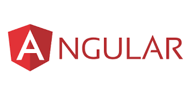

# LEARNING ANGULAR FROM BASIC

# I. Prequisite
- Basic understand Typescript, Html, Css
- Basic using of Git
- Having knowledge with building web api

# II. Ultimate objective
### 1. Context
You're an .NET developer and already having an Web API with following api:
- Login, Logout with JWT token
- Get list of project, create a product, delete a product, update a product
You want to create an angular app that allow login, logout and managing product that will consume your exist apis.
Then this course is absolutely suitable for you.

### 2. After finish this course you can
- Understand the full lifecycle of building an angular app: setup, implementation(design + code) and deployment.
- Can build a basic angular app with features like: 
    - Login 
    - Logout
    - View profile
    - Manage list of products like view list, view detail, add new, update or delete a product.

# III. Syllabus
## 1. Setup
- Install Node.JS, Visual studio, Restful Api Extension, Angular CLI
- Setup project Web API to run: Visual studio, Source code, ...
- Using Angular CLI to create a new angular project
- Try to run the first project

## 2. Implementation
### a. Understand fundamental elements and how an Angular project work
- App structure in a nutshell: Angular app is just a tree of components
- Fundamental elements of App
    - Components
    - Routing
    - Services
    - Dependency injection for Services
    - Modules

### b. Develop a single component
#### **Objective**: Can build an individual component

#### **Output**: Done building following components
- Login component 
- Logout component
- View profile component
- List of product component
- View product component
- Update product component
- Create product component

#### **Content:**
- Using angular-cli to create a new component
- Binding data
- Event handling
- Pipes
- Directives
- Getting parameters
- Lifecycle of a component, hook methods
- Working with basic controls of Prime-NG:
    - Form controls
    - Table
    - Notification
    - Confirmation
    - Popup
    - etc
- Develop a component having a table containing list of items
- Develop a component having form to add new
- Develop a component having form to update a existing item
- Develop a component showing detail of an item
- Perform delete with confirmation popup

## c. Put components together
#### **Objective**: from the requirement then 
- Organize flow of page interactions
- Design the UI/UX screen
- Separate screen into components for reuse and easy to develop
- Put components together to peform a final purpose.  

#### **Output**: Complete the flow of managing a product list with data saved in-memory.

#### **Content**
- Create a wire frame for flow of page interactions
- Separate screens into components, tree of components, common component for reuse
- Exchange data beween components: 
    - Parent component to children component
    - Child component to child component
    - Children components to parent component
    - Between any components
- Jumping between screens(Routing)

### d. Integrate with backend api

#### **Objective**: Until now just save data in-memory. Now we persist data to datastore using backend api and aslo to perform business logic.

#### **Output**: 
- Login and Logout with api
- Update the management of product list by using backend api

#### **Content**:
- Environements
- Restful API Introduction
- HttpClient for making http request
- Inject and use services in components
- Http Error handling
- Error handling
- Authorization with Http Interception
    
### e. Dealing with cross cutting concerns:
- Global error handling
- Notification
- Logging

# III. Deployment:
## 1. Build the project
## 2. Deploy to Server: IIS, Azure Web App
